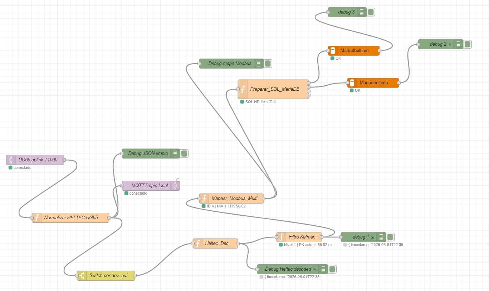

# MinerGuard Node-RED Flow

Flujo Node-RED para recibir uplinks desde **Milesight UG65**, normalizar datos de dispositivos MinerGuard, decodificar payloads de **Heltec T114 / T1000**, mapear posición por beacons, aplicar filtro Kalman y guardar los datos en **MariaDB**.



---

## 1. Descripción general

Este flujo está diseñado para el sistema **MinerGuard**, donde los dispositivos envían datos por LoRaWAN hacia un gateway **Milesight UG65**. El gateway publica los uplinks por MQTT y Node-RED se encarga de procesarlos.

El flujo realiza las siguientes funciones principales:

- Recibe mensajes MQTT desde el UG65.
- Normaliza el JSON del uplink.
- Publica una versión limpia/local del mensaje.
- Filtra o enruta por `dev_eui`.
- Decodifica payloads de Heltec/T1000.
- Extrae información de:
  - frecuencia cardiaca,
  - botón de pánico,
  - conexión BLE,
  - batería de banda,
  - RSSI/SNR LoRaWAN,
  - beacons detectados,
  - posición PK.
- Calcula posición mediante mapeo de beacons.
- Aplica filtro Kalman para suavizar posición.
- Prepara consultas SQL.
- Inserta datos en MariaDB.
- Entrega salidas de depuración para validar cada etapa.

---

## 2. Estructura visual del flujo

En la imagen del flujo se observan los siguientes bloques principales:

| Nodo | Tipo esperado | Función |
|---|---|---|
| `UG65 uplink T1000` | MQTT in | Recibe los uplinks publicados por el gateway UG65. |
| `Normalizar HELTEC UG65` | Function | Limpia y estandariza el JSON recibido. |
| `Debug JSON limpio` | Debug | Muestra el payload normalizado. |
| `MQTT limpio local` | MQTT out | Publica el mensaje limpio en un tópico local. |
| `Switch por dev_eui` | Switch | Separa el flujo según el dispositivo o tipo de payload. |
| `Heltec_Dec` | Function | Decodifica el payload de Heltec/T1000. |
| `Debug Heltec decoded` | Debug | Muestra la información decodificada. |
| `Mapear_Modbus_Multi` | Function | Convierte datos decodificados en variables/registro para posición o integración industrial. |
| `Filtro Kalman` | Function | Suaviza la posición PK estimada. |
| `Preparar_SQL_MariaDB` | Function | Arma consultas SQL para guardar en base de datos. |
| `Mariadbultimo` / `Mariadbultimo` | MySQL/MariaDB | Ejecuta las consultas SQL hacia MariaDB. |
| `debug 1`, `debug 2`, `debug 3`, `Debug mapa Modbus` | Debug | Validación de datos intermedios y errores. |

---

## 3. Requisitos principales

Servidor recomendado:

```text
Ubuntu Server / Debian / Raspberry Pi OS / Siemens IoT2050 Debian
Node.js LTS
Node-RED
Mosquitto MQTT Broker
MariaDB Server
```

Puertos usados normalmente:

| Servicio | Puerto |
|---|---|
| Node-RED | `1880` |
| Mosquitto MQTT | `1883` |
| MariaDB | `3306` |
| TCP industrial opcional | `9001` |

---

## 4. Instalación de Node-RED

### Ubuntu / Debian

Actualizar el sistema:

```bash
sudo apt update
sudo apt upgrade -y
```

Instalar Node.js y npm:

```bash
sudo apt install -y nodejs npm
```

Instalar Node-RED globalmente:

```bash
sudo npm install -g --unsafe-perm node-red
```

Ejecutar Node-RED:

```bash
node-red
```

Abrir en el navegador:

```text
http://localhost:1880
```

Si estás desde otro PC de la red:

```text
http://IP_DEL_SERVIDOR:1880
```

Ejemplo:

```text
http://192.168.100.103:1880
```

---

## 5. Ejecutar Node-RED como servicio

Crear servicio systemd:

```bash
sudo nano /etc/systemd/system/node-red.service
```

Contenido recomendado:

```ini
[Unit]
Description=Node-RED
After=network.target

[Service]
ExecStart=/usr/bin/env node-red
WorkingDirectory=/home/%u/.node-red
User=TU_USUARIO
Group=TU_USUARIO
Nice=10
SyslogIdentifier=Node-RED
StandardOutput=journal
Restart=on-failure

[Install]
WantedBy=multi-user.target
```

Recargar systemd:

```bash
sudo systemctl daemon-reload
```

Activar servicio:

```bash
sudo systemctl enable node-red
sudo systemctl start node-red
```

Ver estado:

```bash
systemctl status node-red
```

Ver logs:

```bash
journalctl -u node-red -f
```

---

## 6. Instalación de Mosquitto MQTT

Instalar broker y clientes:

```bash
sudo apt install -y mosquitto mosquitto-clients
```

Activar servicio:

```bash
sudo systemctl enable mosquitto
sudo systemctl start mosquitto
```

Verificar estado:

```bash
systemctl status mosquitto
```

Probar recepción:

```bash
mosquitto_sub -h 127.0.0.1 -t "minerguard/#" -v
```

Probar publicación:

```bash
mosquitto_pub -h 127.0.0.1 -t "minerguard/test" -m '{"test":"ok"}'
```

---

## 7. Instalación de MariaDB

Instalar MariaDB:

```bash
sudo apt install -y mariadb-server mariadb-client
```

Activar servicio:

```bash
sudo systemctl enable mariadb
sudo systemctl start mariadb
```

Entrar a MariaDB:

```bash
sudo mariadb
```

Crear base de datos:

```sql
CREATE DATABASE minerguard CHARACTER SET utf8mb4 COLLATE utf8mb4_unicode_ci;
```

Crear usuario de ejemplo:

```sql
CREATE USER 'minerguard_user'@'%' IDENTIFIED BY 'CAMBIAR_PASSWORD';
GRANT ALL PRIVILEGES ON minerguard.* TO 'minerguard_user'@'%';
FLUSH PRIVILEGES;
```

> No subir contraseñas reales al repositorio. Usar `.env`, variables de entorno o documentación con valores de ejemplo.

---

## 8. Permitir conexión remota a MariaDB

Editar configuración:

```bash
sudo nano /etc/mysql/mariadb.conf.d/50-server.cnf
```

Buscar:

```ini
bind-address = 127.0.0.1
```

Cambiar por:

```ini
bind-address = 0.0.0.0
```

Reiniciar:

```bash
sudo systemctl restart mariadb
```

Verificar puerto:

```bash
sudo ss -ltnp | grep 3306
```

Probar desde otro equipo:

```powershell
Test-NetConnection IP_DEL_SERVIDOR -Port 3306
```

---

## 9. Librerías / nodos necesarios en Node-RED

Entrar a la carpeta de usuario de Node-RED:

```bash
cd ~/.node-red
```

Instalar nodo MySQL/MariaDB recomendado:

```bash
npm install node-red-node-mysql
```

Este nodo permite ejecutar consultas SQL usando `msg.topic` como query y retorna el resultado en `msg.payload`.

### Alternativas para MariaDB

Si tu flujo fue construido con un nodo específico de MariaDB o MySQL moderno, puedes usar una de estas alternativas:

```bash
npm install node-red-contrib-stackhero-mysql
```

o:

```bash
npm install node-red-contrib-mysql2-ts
```

### Modbus opcional

En la imagen se observa un nodo llamado `Mapear_Modbus_Multi`, pero parece ser un nodo Function y no necesariamente un nodo Modbus real. Si más adelante se agrega integración Modbus TCP/RTU, instalar:

```bash
npm install node-red-contrib-modbus
```

Luego reiniciar Node-RED:

```bash
node-red-restart
```

o:

```bash
sudo systemctl restart node-red
```

---

## 10. Nodos core usados

Estos vienen incluidos normalmente con Node-RED:

| Nodo | Uso |
|---|---|
| `mqtt in` | Recibir uplinks desde UG65/Mosquitto. |
| `mqtt out` | Publicar JSON limpio local. |
| `function` | Normalizar, decodificar, mapear y preparar SQL. |
| `switch` | Enrutar por `dev_eui` u otra condición. |
| `debug` | Verificar payloads y errores. |
| `catch` | Recomendado para capturar errores de nodos. |
| `status` | Recomendado para monitorear conexión de nodos. |

---

## 11. Importar el flujo en Node-RED

1. Abrir Node-RED:

```text
http://IP_DEL_SERVIDOR:1880
```

2. Ir al menú superior derecho.

3. Seleccionar:

```text
Import
```

4. Pegar el contenido del archivo `flows.json` o importar el archivo.

5. Presionar:

```text
Import
```

6. Revisar las credenciales de:
   - servidor MQTT,
   - servidor MariaDB,
   - topics,
   - usuario y password.

7. Presionar:

```text
Deploy
```

---

## 12. Configuración MQTT recomendada

### Nodo `UG65 uplink T1000`

Configurar como MQTT in:

```text
Server: 127.0.0.1
Port: 1883
Topic: minerguard/#
QoS: 0
Output: parsed JSON object, si el mensaje llega en JSON
```

Si el UG65 publica en un tópico específico, usar algo como:

```text
minerguard/t1000/uplink
```

o:

```text
minerguard/up/+
```

### Nodo `MQTT limpio local`

Configurar como MQTT out:

```text
Server: 127.0.0.1
Port: 1883
Topic: minerguard/up/<dev_eui>
QoS: 0
Retain: false
```

---

## 13. Configuración UG65

En el gateway Milesight UG65:

1. Configurar la aplicación LoRaWAN.
2. Registrar los dispositivos OTAA:
   - `DevEUI`
   - `AppEUI / JoinEUI`
   - `AppKey`
3. Configurar integración MQTT.
4. Apuntar el MQTT hacia el servidor Node-RED/Mosquitto.
5. Usar el tópico esperado por el flujo.

Ejemplo conceptual:

```text
MQTT Host: 192.168.100.103
MQTT Port: 1883
Topic uplink: minerguard/t1000/uplink
```

---

## 14. Estructura esperada del JSON normalizado

El nodo `Normalizar HELTEC UG65` debería dejar un objeto limpio parecido a:

```json
{
  "timestamp": "2026-06-01T22:38:00.000Z",
  "application": "Sense_T1000",
  "device_name": "T114-252",
  "dev_eui": "AABBCCDDEEFF0011",
  "fcnt": 120,
  "fport": 1,
  "gateway_id": "c0ba1ffffe0123a0",
  "rssi": -75,
  "snr": 9.5,
  "raw_data_b64": "...",
  "raw_data_hex": "..."
}
```

---

## 15. Payload esperado

Para los nodos Heltec/T1000 de MinerGuard, se usa payload extendido de:

```text
36 bytes
```

Estructura general:

| Byte | Campo |
|---|---|
| `0` | Flags |
| `1` | Frecuencia cardiaca |
| `2` | Batería de banda |
| `3-4` | Node ID |
| `5` | BLE conectado |
| `6-20` | Snapshot A de 3 beacons |
| `21-35` | Snapshot B de 3 beacons |

Cada beacon usa 5 bytes:

```text
Major_H, Major_L, Minor_H, Minor_L, RSSI
```

Convención:

```text
Major = nivel / sector
Minor = PK
```

---

## 16. Flags del payload

| Bit | Máscara | Significado |
|---|---|---|
| `0` | `0x01` | Pánico activo |
| `1` | `0x02` | Frecuencia cardiaca válida |
| `2` | `0x04` | Batería de banda válida |
| `3` | `0x08` | Banda BLE conectada |

---

## 17. Tablas MariaDB recomendadas

### Tabla de lecturas crudas/decodificadas

```sql
CREATE TABLE IF NOT EXISTS lecturas_tag (
  id BIGINT AUTO_INCREMENT PRIMARY KEY,
  ts_server TIMESTAMP DEFAULT CURRENT_TIMESTAMP,
  unit_id INT NULL,
  node_id INT NULL,
  dev_eui VARCHAR(32) NULL,
  fcnt INT NULL,
  frecuencia_cardiaca INT NULL,
  panic TINYINT NULL,
  ble_connected TINYINT NULL,
  battery_band INT NULL,
  rssi INT NULL,
  snr_x10 INT NULL,
  flags INT NULL,
  beacon1_major INT NULL,
  beacon1_minor INT NULL,
  beacon1_rssi INT NULL,
  beacon2_major INT NULL,
  beacon2_minor INT NULL,
  beacon2_rssi INT NULL,
  beacon3_major INT NULL,
  beacon3_minor INT NULL,
  beacon3_rssi INT NULL,
  raw_json JSON NULL
);
```

### Tabla de estado actual

```sql
CREATE TABLE IF NOT EXISTS estado_actual_dispositivos (
  id_dispositivo INT PRIMARY KEY,
  banda_conectada TINYINT NULL,
  bateria_banda INT NULL,
  rssi_lorawan INT NULL,
  snr_x10 INT NULL,
  fcnt INT NULL,
  flags INT NULL,
  posicion_actual INT NULL,
  mayor INT NULL,
  fecha_hora TIMESTAMP DEFAULT CURRENT_TIMESTAMP ON UPDATE CURRENT_TIMESTAMP
);
```

### Tabla histórica

```sql
CREATE TABLE IF NOT EXISTS historico_dispositivos (
  id BIGINT AUTO_INCREMENT PRIMARY KEY,
  id_dispositivo INT NOT NULL,
  heart_rate INT NULL,
  panico TINYINT NULL,
  posicion_actual INT NULL,
  posicion_anterior INT NULL,
  posicion_futura INT NULL,
  latitud DECIMAL(10,7) NULL,
  longitud DECIMAL(10,7) NULL,
  bateria_tag INT NULL,
  mayor INT NULL,
  fecha_hora TIMESTAMP DEFAULT CURRENT_TIMESTAMP
);
```

---

## 18. Preparar SQL en Node-RED

El nodo `Preparar_SQL_MariaDB` debería generar:

```javascript
msg.topic = "INSERT INTO lecturas_tag (...) VALUES (...)";
return msg;
```

o, recomendado, usar consulta parametrizada si el nodo lo permite.

Evitar concatenar directamente valores no controlados cuando el sistema reciba datos externos. En flows productivos, validar y sanear todos los campos antes de armar SQL.

---

## 19. Pruebas rápidas

### Ver si llegan mensajes MQTT

```bash
mosquitto_sub -h 127.0.0.1 -t "minerguard/#" -v
```

### Publicar mensaje de prueba

```bash
mosquitto_pub -h 127.0.0.1 -t "minerguard/t1000/uplink" -m '{"test":"ok desde servidor"}'
```

### Ver si Node-RED está escuchando

```bash
sudo ss -ltnp | grep 1880
```

### Ver si Mosquitto está escuchando

```bash
sudo ss -ltnp | grep 1883
```

### Ver si MariaDB está escuchando

```bash
sudo ss -ltnp | grep 3306
```

---

## 20. Debug esperado

En Node-RED deberían verse mensajes en:

```text
Debug JSON limpio
Debug Heltec decoded
Debug mapa Modbus
debug 1
debug 2
debug 3
```

Ejemplo de salida esperada del filtro de posición:

```json
{
  "timestamp": "2026-06-01T22:38:00.000Z",
  "node_id": 6,
  "nivel": 1,
  "pk_actual": 63,
  "rssi": -72,
  "snr_x10": 95
}
```

---

## 21. Problemas frecuentes

### No llegan mensajes desde UG65

Revisar:

```bash
mosquitto_sub -h 127.0.0.1 -t "minerguard/#" -v
```

Si no aparece nada:

- revisar host MQTT en UG65,
- revisar IP del servidor,
- revisar firewall,
- revisar puerto `1883`,
- revisar tópico configurado.

---

### Node-RED muestra `connected`, pero no guarda en MariaDB

Revisar:

```bash
systemctl status mariadb
sudo ss -ltnp | grep 3306
```

Probar conexión desde el servidor:

```bash
mariadb -h 127.0.0.1 -u minerguard_user -p minerguard
```

---

### Error `ETIMEDOUT` hacia MariaDB

Posibles causas:

- IP incorrecta.
- Puerto `3306` bloqueado.
- MariaDB escuchando solo en `127.0.0.1`.
- Usuario sin permisos para conexión remota.
- Firewall bloqueando.

---

### Error `Pool is closed`

Posibles causas:

- Nodo MariaDB quedó con configuración antigua.
- Deploy parcial dejó conexión en mal estado.
- Reiniciar Node-RED:

```bash
sudo systemctl restart node-red
```

---

### `dev_eui` aparece como `unknown`

Puede ocurrir cuando el normalizador no encuentra el campo esperado dentro del JSON del UG65. Revisar el debug antes de `Normalizar HELTEC UG65` y adaptar el parser al formato real del gateway.

---

## 22. Seguridad recomendada

Para uso en terreno o producción:

- No exponer Node-RED directamente a internet.
- Configurar usuario y contraseña en Node-RED.
- Proteger Mosquitto con usuario/contraseña.
- No subir passwords al repositorio.
- Usar `.env` o variables de entorno.
- Restringir MariaDB por IP.
- Mantener backups de `flows.json`, `flows_cred.json` y base de datos.

---

## 23. Archivos recomendados para el repositorio

```text
MinerGuard_NodeRED/
├── README.md
├── flows/
│   └── minerguard-flow.json
├── assets/
│   └── node-red-minerguard-flow.png
├── sql/
│   └── schema_minerguard.sql
├── docs/
│   └── payload_36_bytes.md
└── examples/
    └── mqtt_test_payload.json
```

---

## 24. .gitignore recomendado

```gitignore
# Credenciales Node-RED
flows_cred.json
.env

# Backups automáticos
*.backup
*.bak
*.tmp

# Node modules
node_modules/

# Logs
*.log

# Sistema
.DS_Store
Thumbs.db
```

---

## 25. Links útiles

### Node-RED

```text
https://nodered.org/
```

### Instalación Node-RED

```text
https://nodered.org/docs/getting-started/local
```

### Agregar nodos / Palette Manager

```text
https://nodered.org/docs/user-guide/runtime/adding-nodes
```

### Node-RED MySQL node

```text
https://flows.nodered.org/node/node-red-node-mysql
```

### Node-RED Modbus opcional

```text
https://flows.nodered.org/node/node-red-contrib-modbus
```

### Mosquitto MQTT

```text
https://mosquitto.org/
```

### MariaDB

```text
https://mariadb.org/
```

### Milesight UG65

```text
https://www.milesight.com/iot/product/lorawan-gateway/ug65
```

---

## 26. Estado del flujo

Flujo base observado:

```text
UG65 uplink T1000
→ Normalizar HELTEC UG65
→ Switch por dev_eui
→ Heltec_Dec
→ Filtro Kalman
→ Preparar_SQL_MariaDB
→ MariaDB
```

El flujo está orientado a operación con:

```text
LoRaWAN + UG65 + MQTT + Node-RED + MariaDB + MinerGuard
```
