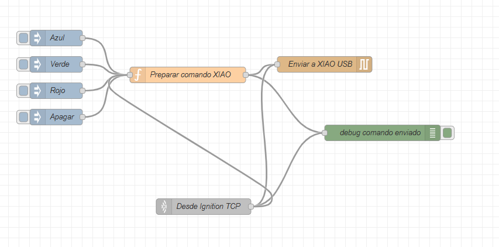

# MinerGuard Node-RED - Control XIAO USB desde Ignition TCP

Flujo Node-RED para enviar comandos desde **Ignition** hacia un **Seeed Studio XIAO nRF52840 / XIAO nRF52840 Sense** conectado por USB al servidor donde corre Node-RED.

El objetivo del flujo es controlar luces o estados de alarma en el XIAO mediante comandos recibidos por TCP desde Ignition.



---

## 1. Descripción general

Este flujo permite que Ignition envíe comandos por TCP a Node-RED, y que Node-RED los reenvíe por USB Serial al XIAO.

La lógica principal es:

```text
Ignition
   ↓ TCP puerto 9001
Desde Ignition TCP
   ↓
Preparar comando XIAO
   ↓
Enviar a XIAO USB
   ↓ USB Serial 115200
XIAO nRF52840
```

---

## 2. Punto más importante del flujo

La parte realmente importante para operación final es la conexión entre:

```text
Desde Ignition TCP → Enviar a XIAO USB
```

o, de forma recomendada para normalizar comandos:

```text
Desde Ignition TCP → Preparar comando XIAO → Enviar a XIAO USB
```

Los nodos:

```text
Azul
Verde
Rojo
Apagar
```

son solamente nodos de prueba manual. Sirven para verificar desde Node-RED si el XIAO responde, pero no son la vía final de operación.

En producción, el comando debe venir desde Ignition por TCP, entrar al nodo:

```text
Desde Ignition TCP
```

y terminar saliendo hacia el nodo:

```text
Enviar a XIAO USB
```

Ese enlace es el que permite que Ignition controle físicamente el XIAO.

---

## 3. Archivos del proyecto

Estructura recomendada para GitHub:

```text
MinerGuard_XIAO_NodeRED/
├── README.md
├── flows/
│   └── respaldoxiao.json
└── assets/
    └── node-red-xiao-flow.png
```

---

## 4. Hardware utilizado

Placa recomendada:

```text
Seeed Studio XIAO nRF52840
Seeed Studio XIAO nRF52840 Sense
```

Comunicación:

```text
USB CDC Serial
Baudrate: 115200
```

El XIAO debe tener cargado un firmware Arduino que escuche comandos por `Serial` y active las salidas correspondientes.

---

## 5. Software necesario

Servidor recomendado:

```text
Ubuntu / Debian / Raspberry Pi OS / Siemens IoT2050 Debian
Node.js LTS
Node-RED
node-red-node-serialport
Ignition
Arduino IDE
```

---

## 6. Instalación de Node-RED

### Ubuntu / Debian

Actualizar sistema:

```bash
sudo apt update
sudo apt upgrade -y
```

Instalar Node.js y npm:

```bash
sudo apt install -y nodejs npm
```

Instalar Node-RED:

```bash
sudo npm install -g --unsafe-perm node-red
```

Ejecutar:

```bash
node-red
```

Abrir en navegador:

```text
http://localhost:1880
```

Desde otro equipo de la red:

```text
http://IP_DEL_SERVIDOR:1880
```

Ejemplo:

```text
http://192.168.100.103:1880
```

---

## 7. Librerías / nodos necesarios en Node-RED

Este flujo usa principalmente nodos core de Node-RED y un nodo adicional para comunicación serial.

### Nodos core usados

| Nodo | Uso |
|---|---|
| `inject` | Pruebas manuales: Azul, Verde, Rojo y Apagar. |
| `function` | Preparar o traducir comandos para el XIAO. |
| `tcp in` | Recibir comandos desde Ignition por TCP. |
| `debug` | Verificar qué comando se está enviando. |

### Nodo adicional obligatorio

| Nodo | Paquete | Uso |
|---|---|---|
| `serial out` | `node-red-node-serialport` | Enviar comandos al XIAO por USB Serial. |

Instalar desde Palette Manager:

```text
Menu → Manage palette → Install → node-red-node-serialport
```

O por terminal:

```bash
cd ~/.node-red
npm install node-red-node-serialport
```

Reiniciar Node-RED:

```bash
node-red-restart
```

o:

```bash
sudo systemctl restart node-red
```

---

## 8. Configuración del puerto serial XIAO

En el flujo, el nodo serial está configurado como:

```text
Nombre: XIAO nRF52840 USB
Puerto: /dev/ttyACM0
Baudrate: 115200
Data bits: 8
Parity: none
Stop bits: 1
Newline: \n
Output: char
```

En Linux, el puerto puede cambiar. Para identificarlo:

```bash
ls /dev/ttyACM*
ls /dev/ttyUSB*
```

También puedes usar:

```bash
dmesg | grep tty
```

O, más recomendado:

```bash
ls -l /dev/serial/by-id/
```

Ejemplo de puerto estable:

```text
/dev/serial/by-id/usb-Seeed_XIAO_nRF52840_Sense_XXXX-if00
```

Si existe esa ruta, conviene usarla en vez de `/dev/ttyACM0`, porque `/dev/ttyACM0` puede cambiar al reiniciar o conectar otro dispositivo USB.

---

## 9. Permisos seriales en Linux

Si Node-RED no puede abrir el puerto USB, agregar el usuario al grupo `dialout`:

```bash
sudo usermod -a -G dialout $USER
```

Cerrar sesión y volver a entrar, o reiniciar:

```bash
sudo reboot
```

Verificar permisos:

```bash
ls -l /dev/ttyACM0
```

---

## 10. Configuración del nodo `Desde Ignition TCP`

El nodo TCP está configurado como servidor:

```text
Nodo: Desde Ignition TCP
Tipo: tcp in
Modo: server
Puerto: 9001
Tipo de dato: buffer
Newline: \n
```

Esto significa que Node-RED queda escuchando en el puerto:

```text
9001
```

Ignition debe conectarse a:

```text
IP_DEL_SERVIDOR_NODE_RED:9001
```

Ejemplo:

```text
192.168.100.103:9001
```

---

## 11. Comandos aceptados

El nodo `Preparar comando XIAO` convierte comandos de Ignition en textos que el XIAO debe entender.

| Comando recibido | Comando enviado al XIAO |
|---|---|
| `AZUL` | `AZUL\n` |
| `HOMAQ` | `AZUL\n` |
| `VERDE` | `VERDE\n` |
| `SISMICO` | `VERDE\n` |
| `SÍSMICO` | `VERDE\n` |
| `ROJO` | `ROJO\n` |
| `INCENDIO` | `ROJO\n` |
| `ALARMA` | `ROJO\n` |
| `APAGAR` | `APAGAR\n` |
| `OFF` | `APAGAR\n` |
| `VOLVER` | `APAGAR\n` |

---

## 12. Uso recomendado desde Ignition

Desde Ignition, enviar comandos de texto por TCP al servidor Node-RED.

Ejemplos:

```text
INCENDIO
SISMICO
HOMAQ
APAGAR
```

También se pueden enviar directamente:

```text
ROJO
VERDE
AZUL
APAGAR
```

Cada mensaje debe terminar idealmente con salto de línea:

```text
\n
```

Ejemplo conceptual:

```text
INCENDIO\n
```

---

## 13. Diferencia entre nodos de prueba y nodo final

### Nodos de prueba

Estos nodos son solo para probar manualmente desde Node-RED:

```text
Azul
Verde
Rojo
Apagar
```

Sirven para validar:

- que Node-RED está activo,
- que el puerto USB del XIAO está bien configurado,
- que el firmware del XIAO responde,
- que el nodo `Enviar a XIAO USB` funciona.

No dependen de Ignition.

### Nodo final de operación

El nodo final de operación es:

```text
Desde Ignition TCP
```

Este nodo representa la entrada real desde Ignition. Por eso, para la integración definitiva, lo importante es que esté unido al camino de salida hacia:

```text
Enviar a XIAO USB
```

Si esa unión no está hecha, Ignition puede enviar comandos, pero el XIAO no recibirá nada.

---

## 14. Advertencia sobre la conexión directa TCP → Serial

En el respaldo del flujo, el nodo `Desde Ignition TCP` aparece conectado tanto al nodo serial como al nodo de función.

Esto permite dos formas de trabajo:

### Forma directa

```text
Desde Ignition TCP → Enviar a XIAO USB
```

Usar esta forma solo si Ignition ya envía exactamente lo que el XIAO espera, por ejemplo:

```text
ROJO\n
VERDE\n
AZUL\n
APAGAR\n
```

### Forma recomendada

```text
Desde Ignition TCP → Preparar comando XIAO → Enviar a XIAO USB
```

Esta es más segura porque permite que Ignition envíe comandos industriales como:

```text
INCENDIO
SISMICO
HOMAQ
OFF
```

y Node-RED los traduce al formato que el XIAO entiende.

---

## 15. Importar el flujo en Node-RED

1. Abrir Node-RED:

```text
http://IP_DEL_SERVIDOR:1880
```

2. Ir al menú superior derecho.

3. Seleccionar:

```text
Import
```

4. Cargar el archivo:

```text
flows/respaldoxiao.json
```

5. Presionar:

```text
Import
```

6. Revisar el puerto serial del nodo:

```text
Enviar a XIAO USB
```

7. Revisar el puerto TCP del nodo:

```text
Desde Ignition TCP
```

8. Presionar:

```text
Deploy
```

---

## 16. Pruebas desde Node-RED

Primero probar con los nodos manuales:

```text
Azul
Verde
Rojo
Apagar
```

Si el XIAO responde correctamente, el problema no está en el USB ni en el firmware.

Luego probar desde TCP.

---

## 17. Prueba TCP desde Linux

Desde el mismo servidor:

```bash
echo "ROJO" | nc 127.0.0.1 9001
```

Desde otro equipo de la red:

```bash
echo "ROJO" | nc IP_DEL_SERVIDOR 9001
```

Ejemplo:

```bash
echo "INCENDIO" | nc 192.168.100.103 9001
```

Para apagar:

```bash
echo "APAGAR" | nc 192.168.100.103 9001
```

---

## 18. Prueba TCP desde Windows PowerShell

Abrir PowerShell y ejecutar:

```powershell
$client = New-Object System.Net.Sockets.TcpClient("192.168.100.103",9001)
$stream = $client.GetStream()
$data = [System.Text.Encoding]::ASCII.GetBytes("ROJO`n")
$stream.Write($data,0,$data.Length)
$client.Close()
```

Cambiar `192.168.100.103` por la IP real del servidor Node-RED.

---

## 19. Prueba directa del puerto serial

Antes de probar Node-RED, puedes verificar si el XIAO responde por USB.

### Linux

```bash
echo "ROJO" > /dev/ttyACM0
```

O usando `screen`:

```bash
screen /dev/ttyACM0 115200
```

### Windows

Usar el Monitor Serial de Arduino IDE:

```text
Baudrate: 115200
Enviar: ROJO
Enviar: VERDE
Enviar: AZUL
Enviar: APAGAR
```

---

## 20. Recomendación para el firmware del XIAO

El firmware del XIAO debería leer comandos por Serial:

```cpp
String cmd = Serial.readStringUntil('\n');
cmd.trim();
cmd.toUpperCase();
```

Y reaccionar a:

```text
ROJO
VERDE
AZUL
APAGAR
```

En una lógica de alarmas MinerGuard:

| Comando XIAO | Uso sugerido |
|---|---|
| `ROJO` | Incendio / alarma crítica. |
| `VERDE` | Sismo / estado asignado. |
| `AZUL` | Hombre-máquina / estado asignado. |
| `APAGAR` | Volver a estado normal. |

---

## 21. Revisión de puerto ocupado

Si el nodo serial no conecta, puede ser porque otro programa está usando el puerto.

Revisar procesos:

```bash
sudo lsof /dev/ttyACM0
```

Cerrar Arduino Serial Monitor si está abierto, porque puede bloquear el puerto.

---

## 22. Verificar que Node-RED escucha el puerto TCP

```bash
sudo ss -ltnp | grep 9001
```

Debería aparecer un proceso de Node-RED escuchando en:

```text
0.0.0.0:9001
```

o:

```text
:::9001
```

---

## 23. Problemas frecuentes

### El XIAO no responde a comandos

Revisar:

- Puerto serial correcto.
- Baudrate `115200`.
- Firmware del XIAO cargado.
- Arduino Serial Monitor cerrado.
- Usuario con permisos `dialout`.
- Que el comando termine con `\n`.

---

### Ignition envía, pero no cambia la luz

Revisar:

1. Que Ignition apunte a la IP correcta del servidor.
2. Que use el puerto `9001`.
3. Que el nodo `Desde Ignition TCP` muestre actividad.
4. Que el debug `debug comando enviado` muestre el comando.
5. Que el nodo `Enviar a XIAO USB` esté conectado y con puerto correcto.
6. Que la unión hacia `Enviar a XIAO USB` exista.

---

### Los botones Azul/Verde/Rojo/Apagar no funcionan

En el respaldo, algunos inject pueden enviar letras como:

```text
R
G
B
O
```

Pero la función espera comandos como:

```text
AZUL
VERDE
ROJO
APAGAR
```

Solución rápida:

- Cambiar el payload de los inject a `AZUL`, `VERDE`, `ROJO` y `APAGAR`.

O agregar estos casos a la función:

```javascript
case "B":
    salida = "AZUL\n";
    break;

case "G":
    salida = "VERDE\n";
    break;

case "R":
    salida = "ROJO\n";
    break;

case "O":
    salida = "APAGAR\n";
    break;
```

Esto solo afecta a las pruebas manuales. La integración final desde Ignition puede funcionar igual si Ignition envía los comandos completos.

---

## 24. Función recomendada completa

Para aceptar tanto comandos completos como letras de prueba, se puede usar esta versión en `Preparar comando XIAO`:

```javascript
let comando = msg.payload;

if (Buffer.isBuffer(comando)) {
    comando = comando.toString("utf8");
}

comando = String(comando).trim().toUpperCase();

let salida = null;

switch (comando) {
    case "AZUL":
    case "HOMAQ":
    case "B":
        salida = "AZUL\n";
        break;

    case "VERDE":
    case "SISMICO":
    case "SÍSMICO":
    case "G":
        salida = "VERDE\n";
        break;

    case "ROJO":
    case "INCENDIO":
    case "ALARMA":
    case "R":
        salida = "ROJO\n";
        break;

    case "APAGAR":
    case "OFF":
    case "VOLVER":
    case "O":
        salida = "APAGAR\n";
        break;

    default:
        node.warn("Comando no reconocido desde Ignition: " + comando);
        return null;
}

msg.payload = salida;
msg.topic = "comando_xiao";

return msg;
```

---

## 25. Resumen final

Para pruebas manuales:

```text
Azul / Verde / Rojo / Apagar → Preparar comando XIAO → Enviar a XIAO USB
```

Para operación real:

```text
Ignition → Desde Ignition TCP → Preparar comando XIAO → Enviar a XIAO USB → XIAO
```

La unión más importante para el sistema final es que el comando recibido por:

```text
Desde Ignition TCP
```

termine llegando a:

```text
Enviar a XIAO USB
```

Los inject manuales quedan solo como respaldo para probar el funcionamiento sin depender de Ignition.

---

## 26. Links útiles

### Node-RED

```text
https://nodered.org/
```

### Instalar nodos en Node-RED / Palette Manager

```text
https://nodered.org/docs/user-guide/runtime/adding-nodes
```

### Nodo serial para Node-RED

```text
https://flows.nodered.org/node/node-red-node-serialport
```

### Seeed Studio XIAO nRF52840

```text
https://wiki.seeedstudio.com/XIAO_BLE/
```

### Arduino IDE

```text
https://www.arduino.cc/en/software
```

### Ignition

```text
https://inductiveautomation.com/ignition/
```
